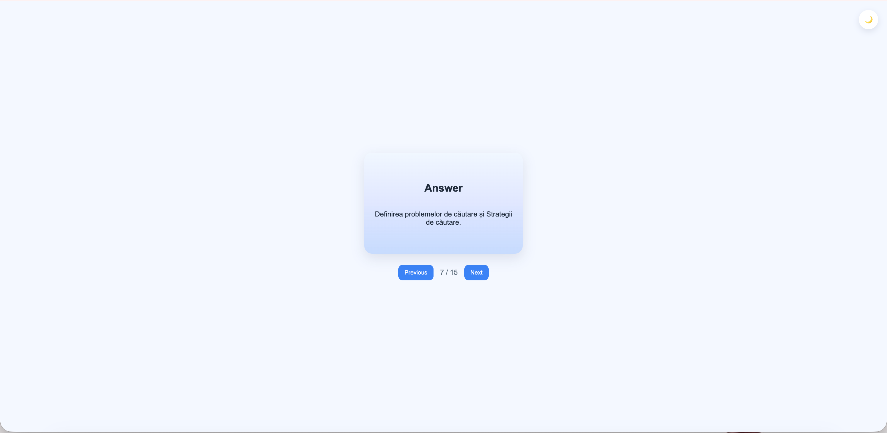

# 📚 Flashcards AI

Generate smart flashcards from PDF files using AI.

Upload a document and instantly get study-ready flashcards — perfect for exams, summaries, and fast learning.

---

## 🚀 Features

- 📄 Upload PDF files
- 🤖 AI-generated flashcards (15 per document)
- 🌍 Automatic language detection (Romanian, English, etc.)
- 🎴 Interactive flashcards with flip animation
- 🌙 Dark / Light mode toggle
- ⚡ Fast processing (first 5 pages for speed)

---

## 🧠 How it works

1. User uploads a PDF
2. Backend extracts text using `pdfplumber`
3. AI generates flashcards using Google Gemini
4. Frontend displays them in an interactive UI

---

## 🛠 Tech Stack

### Frontend
- HTML
- CSS (custom UI + dark mode)
- JavaScript (vanilla)

### Backend
- Python (Flask)
- pdfplumber
- Google Generative AI (Gemini)
- langdetect

---

## 📸 Demo & Screenshots

### Home / Upload Page
Here you can upload your PDF and start the generation process:

