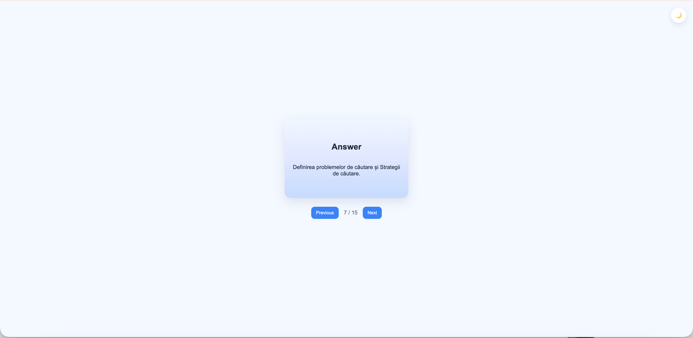

# 📚 Flashcards AI

Generate smart flashcards from PDF/DOCX files using AI.

Upload a document and instantly get study-ready flashcards — perfect for exams, summaries and fast learning.

---

## 🚀 Features

- 📄 Upload PDF/DOCX files
- 🤖 AI-generated flashcards
- 🌍 Automatic language detection (Romanian, English, etc.)
- 🎴 Interactive flashcards with flip animation
- 🌙 Dark / Light mode toggle
- ⚡ Fast processing (first 5 pages for speed)

---

## 🧠 How it works

1. User uploads a PDF/DOCX
2. Backend extracts text using `pdfplumber`
3. AI generates flashcards using Google Gemini
4. Frontend displays them in an interactive UI

---

## 🛠 Tech Stack

### Frontend
- HTML
- CSS (custom UI + dark mode)
- JavaScript (vanilla)

### Backend
- Python (Flask)
- pdfplumber
- Google Generative AI (Gemini)
- langdetect

---

## ⚙️ Setup & Local Development

### Prerequisites
- Python 3.x
- An API Key for Google Gemini (set in a `.env` file)

### 1. Clone the repository
```bash
git clone https://github.com/andrada0410/FlashcardsApp.git
cd FlashcardsApp
```

### 2. Set Up Environment Variables
Create a `.env` file inside the `backend/` directory and add your API Key:

```env
GEMINI_API_KEY=your_api_key
```

### 3. Install Dependencies & Start Backend
Navigate to the backend/ directory, set up a virtual environment, install dependencies, and run the server:

```bash
cd backend
```

Create virtual environment
```bash
python -m venv .venv
```

 Activate virtual environment


On Windows:
```bash
.venv\Scripts\activate
```
On macOS/Linux:
```bash
source .venv/bin/activate
```

 Install required packages
```bash
pip install -r requirements.txt
```

 Run the app
```bash
python app.py
```
### 4. Access the Application
Open your browser and navigate to: http://127.0.0.1:5000

---

## 📸 Demo & Screenshots

### Home / Upload Page
Here you can upload your PDF and start the generation process:





